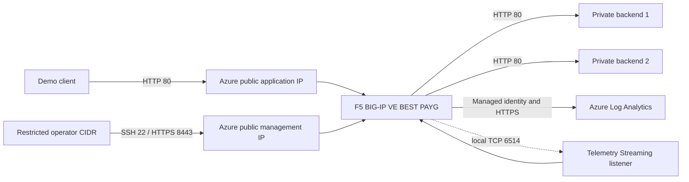

# F5 BIG-IP Observability Lab

This lab deploys a standalone F5 BIG-IP Virtual Edition BEST (PAYG), two private web backends, and a dedicated Azure Log Analytics workspace. Post-deployment automation configures LTM, AWAF, system/audit logging, and F5 Telemetry Streaming (TS) so operational events and statistics arrive in `F5Telemetry_CL`.

The lab is intentionally disposable. It is not a production BIG-IP topology: there is no HA pair, the application listener is HTTP, and management uses the appliance's self-signed certificate.

## Telemetry Scope

The automation produces and forwards:

- BIG-IP system and MCP audit events
- LTM request and response events
- LTM virtual server, pool, and pool-member statistics
- ASM/AWAF security events for blocked requests
- Device, interface, CPU, memory, and provisioning statistics from the TS system poller

"All logs" means these configured and licensed sources. It does not include events from unlicensed or unconfigured modules such as APM, AFM, DNS, AVR, or CGNAT.

## Architecture



See [docs/architecture.md](docs/architecture.md) for the control-plane and log flow details.

## Prerequisites

- Azure CLI authenticated to the target subscription
- Terraform `1.6` or later
- PowerShell `7.4` or later
- An SSH public key
- Permission to create resources and role assignments at subscription scope
- A real public management CIDR; never use `0.0.0.0/0`
- Authorization to accept and incur charges for the F5 Marketplace offer

The default image values are intentionally distinct:

| Setting | Value |
|---|---|
| Publisher | `f5-networks` |
| Offer | `f5-big-ip-best` |
| Marketplace plan | `f5-big-best-plus-hourly-25mbps` |
| Image SKU | `f5-big-best-plus-hourly-25mbps-po-f5` |
| Image version | `21.0.001000` |

Revalidate image availability and pricing before every deployment.

## 1. Accept Marketplace Terms

Terms acceptance is an explicit operator action and is not automated by Terraform.

```powershell
az account set --subscription <subscription-id>

az vm image terms show `
  --publisher f5-networks `
  --offer f5-big-ip-best `
  --plan f5-big-best-plus-hourly-25mbps `
  --query accepted
```

After reviewing the legal terms and PAYG charges, an authorized operator can accept them:

```powershell
az vm image terms accept `
  --publisher f5-networks `
  --offer f5-big-ip-best `
  --plan f5-big-best-plus-hourly-25mbps
```

## 2. Configure Terraform

Create a local variables file from [terraform/terraform.tfvars.example](terraform/terraform.tfvars.example). Replace the example management CIDR and SSH key.

```powershell
Set-Location labs/f5-bigip-observability/terraform
Copy-Item terraform.tfvars.example terraform.tfvars
```

Review the configuration, then run the deployment commands only after the deployment gate is approved:

```powershell
terraform init
terraform plan -out f5-observability.tfplan
terraform apply f5-observability.tfplan
```

The repository automation does not run `terraform apply` for you.

## 3. Set the BIG-IP Admin Password

Terraform provisions SSH key access but does not place a BIG-IP password in state. Use the Terraform SSH username to connect, then set the built-in `admin` password interactively:

```powershell
$managementIp = terraform output -raw bigip_management_public_ip
ssh azureuser@$managementIp
sudo tmsh modify auth user admin prompt-for-password
```

Do not put the password on a command line, in `terraform.tfvars`, or in shell history.

## 4. Configure BIG-IP and Telemetry

Return to the lab directory and run a preflight. `-WhatIf` makes no appliance changes and does not download packages.

```powershell
Set-Location ..
$password = Read-Host 'BIG-IP admin password' -AsSecureString
./scripts/Configure-BigIp.ps1 -AdminPassword $password -WhatIf
```

Apply the configuration:

```powershell
./scripts/Configure-BigIp.ps1 -AdminPassword $password
```

The script:

1. Reads applied values from `terraform output -json`.
2. Waits for the BIG-IP REST API.
3. Downloads pinned DO `1.47.0`, AS3 `3.56.0`, and TS `1.41.0` RPMs.
4. Verifies each RPM against F5's published SHA-256 checksum.
5. Installs missing extensions through iControl LX.
6. Provisions LTM and ASM, then posts TS and AS3 declarations.
7. Enables local system/audit forwarding and saves the BIG-IP configuration.

Rerunning the script converges on the same declarations and skips installed extensions. Use `-SkipExtensionInstall` when packages were installed by another controlled process.

## 5. Generate Logs

Send ordinary traffic and WAF test requests:

```powershell
./scripts/Invoke-DemoTraffic.ps1
```

Attack test requests should normally return HTTP `403`. A temporary `200` can occur while a newly created AWAF policy finishes compiling; inspect ASM events before assuming enforcement failed.

Generate a reversible pool-member incident. The script disables one member, waits long enough for the 60-second poller to observe it, and re-enables it in a `finally` block:

```powershell
./scripts/Invoke-PoolFailure.ps1 -AdminPassword $password
```

## 6. Verify Log Analytics

Initial custom-table creation and ingestion can take several minutes.

```powershell
./scripts/Test-Telemetry.ps1
```

Reusable queries are in [queries](queries):

- [overview.kql](queries/overview.kql) summarizes event categories.
- [http-and-waf.kql](queries/http-and-waf.kql) finds LTM and ASM events.
- [pool-health.kql](queries/pool-health.kql) finds pool-health transitions and poller snapshots.

If `F5Telemetry_CL` does not exist yet, check `/var/log/restnoded/restnoded.log`, the TS declaration at `/mgmt/shared/telemetry/declare`, managed-identity RBAC propagation, and outbound HTTPS reachability.

## Security Notes

- BIG-IP uses a system-assigned managed identity. No Log Analytics shared key is stored in Terraform or this repository.
- The identity receives `Log Analytics Contributor` at workspace scope and `Reader` at subscription scope because TS discovers the workspace before ingestion.
- Log Analytics local authentication remains enabled because this TS consumer uses the established Log Analytics ingestion path after managed-identity workspace discovery.
- The BIG-IP management NSG accepts SSH and TCP `8443` only from `management_cidr`.
- The configurator accepts the BIG-IP self-signed management certificate only for direct calls to the explicitly selected management IP.
- The system-log step uses `remote-servers replace-all-with`. This is deliberate for a disposable appliance and would overwrite existing remote syslog targets on a shared BIG-IP.
- Downloaded RPMs and Terraform state are ignored by Git.

## Cleanup

Review the destroy plan and run cleanup only when authorized:

```powershell
Set-Location terraform
terraform plan -destroy -out destroy.tfplan
terraform apply destroy.tfplan
```

Marketplace terms acceptance is subscription-level and is not reverted by `terraform destroy`.

## References

- [F5 Telemetry Streaming event listener](https://clouddocs.f5.com/products/extensions/f5-telemetry-streaming/latest/event-listener.html)
- [F5 Telemetry Streaming Azure Log Analytics consumer](https://clouddocs.f5.com/products/extensions/f5-telemetry-streaming/latest/setting-up-consumer.html#microsoft-azure-log-analytics)
- [F5 AS3 installation](https://clouddocs.f5.com/products/extensions/f5-appsvcs-extension/latest/userguide/installation.html)
- [Azure managed identities](https://learn.microsoft.com/entra/identity/managed-identities-azure-resources/overview)
- [Azure Monitor log query overview](https://learn.microsoft.com/azure/azure-monitor/logs/log-query-overview)