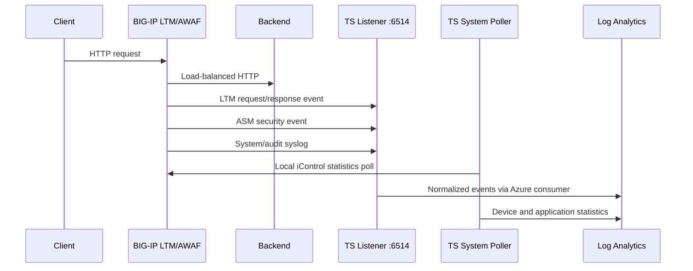

# Architecture and Automation Boundaries

## Resource Topology

Terraform creates one resource group containing:

- One Generation 1 F5 BIG-IP VE VM using Standard security and a system-assigned identity
- One NIC with a primary management address and a secondary application VIP
- Two Standard static public IPs, one restricted for management and one for application traffic
- Two private Ubuntu backend VMs running Python's standard-library HTTP server
- One VNet with separate BIG-IP and backend subnets
- Separate BIG-IP and backend NSGs
- One PerGB2018 Log Analytics workspace with 30-day retention
- Workspace-scoped `Log Analytics Contributor` and subscription-scoped `Reader` assignments for BIG-IP

The backend subnet has no default outbound access. Backend initialization therefore does not install packages from the Internet. The BIG-IP NIC has an explicit Standard public IP and requires outbound HTTPS for Azure APIs, Log Analytics ingestion, and extension workflows.

## Data Flow

The listener uses the F5-documented local virtual address `255.255.255.254:6514`, an HSL pool, a Splunk-formatted log destination, and a local TS listener. The name "Splunk" here is an F5 log formatting mode; Splunk is not deployed or contacted.

## Responsibility Boundaries

| Layer | Responsibility |
|---|---|
| Terraform | Azure resource lifecycle, networking, public/private addresses, identity, RBAC, and outputs |
| PowerShell | BIG-IP readiness, verified extension packages, declaration rendering, posting, retry, and verification |
| Declarative Onboarding | LTM/ASM provisioning and appliance hostname |
| AS3 | VIP, pool, health monitor, WAF attachment, HSL objects, and LTM/ASM log profiles |
| Telemetry Streaming | Local polling/listening, normalization, managed-identity workspace discovery, and ingestion |
| Operator | Marketplace terms, deployment approval, BIG-IP admin password, incident authorization, and cleanup |

## Failure Modes

| Symptom | Likely cause | Check |
|---|---|---|
| Management API unavailable | Boot or license initialization incomplete, or CIDR mismatch | VM boot diagnostics, NSG source CIDR, TCP `8443` |
| Extension endpoint unavailable | RPM install task failed or restnoded restarted | Package task response and `/var/log/restnoded/restnoded.log` |
| Application VIP returns 503 | Both pool members unavailable or backend cloud-init incomplete | AS3 result, pool member state, backend service |
| WAF tests return 200 | Policy compile/staging delay or policy not attached | ASM policy state and virtual server `policyWAF` |
| No `F5Telemetry_CL` table | First ingestion pending, TS consumer error, RBAC propagation, or no egress | TS declaration/status, managed identity roles, outbound HTTPS |
| Poller data but no LTM/ASM events | Event listener or AS3 logging objects failed | Port `6514`, HSL pool, traffic/security log profiles |

## Production Changes Required

Before adapting this design for production, use an HA pair across zones, separate management/data NICs, private management access, controlled egress, TLS application listeners, a production WAF policy lifecycle, remote state, centralized secrets, non-destructive syslog merging, and change-controlled extension artifacts.