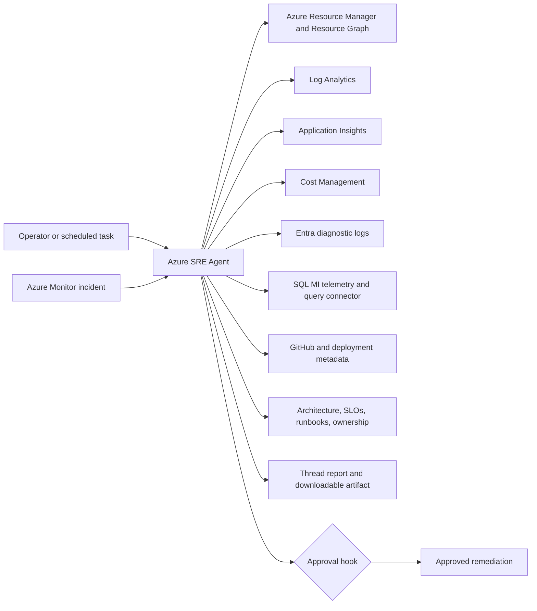

# Enterprise Operations Scenario Pack

This scenario pack turns thirteen common Azure operations questions into repeatable Azure SRE Agent
exercises. It is designed as a **modular overlay**, not as thirteen independent deployments. Reuse
the workload and telemetry from the existing labs, then add only the identity, SQL Managed Instance,
capacity, and multi-subscription components that require new Azure resources.

For the complete resource decisions, implementation sequence, and step-by-step SRE Agent procedure
for every use case, see the
[Enterprise Operations Use-Case Guide](docs/use-case-implementation-guide.md).

> Status: Terraform implementation complete and locally validated. The overlay still requires a
> deployed Zava workload and an environment-specific Azure `plan` before it can be applied.

## Learning outcomes

After completing the pack, an operator can:

- investigate an incident by correlating metrics, logs, topology, resource state, and changes;
- distinguish live mitigation from a durable fix and require approval for risky actions;
- produce evidence-grounded availability, change, cost, capacity, security, and estate reports;
- explain which data source supports every conclusion and identify visibility gaps;
- operate one agent across related scopes without granting unnecessary write permissions.

## Recommended lab shape

Use one primary Azure SRE Agent with five capability modules. Keep write access disabled by default.

| Module | Scenarios | Starting point | Build status |
|---|---:|---|---|
| Incident and application operations | 1, 3, 10 | `zava-learning`, `zava-aks-postgres`, `vm-cosmosdb`, `deployment-compliance` | Mostly reusable |
| Network operations | 2 | `zava-learning` connectivity lane | Extend topology |
| Data and identity operations | 4, 8 | New SQL MI and Entra telemetry modules | New build |
| Governance and FinOps | 6, 7, 11, 12 | `deployment-compliance`, `public-port-guard`, `zava-learning` cost audit | Extend |
| Reliability and fleet operations | 5, 9, 13 | VM telemetry plus new forecast and cross-subscription scope | New build |

Do not put unrelated production teams under one agent merely because the identity can read them.
Split agents when ownership, permissions, data residency, or operational knowledge differs.

## Reference architecture



### Shared Azure resources

Create these once for the scenario pack:

| Resource | Purpose |
|---|---|
| Azure SRE Agent | Investigation, reporting, scheduled tasks, and controlled remediation |
| User-assigned managed identity | Stable agent identity for RBAC across scopes |
| Log Analytics workspace | Activity Log, VM, network, Entra, SQL, and security evidence |
| Application Insights | Request, dependency, exception, and application availability telemetry |
| Azure Monitor alerts and action group | Symptom-only incident dispatch |
| Storage account | Optional report artifacts and synthetic seed data |
| Existing Zava workload | Application, network, deployment, database, and VM incident surface |

### Optional resources with material cost or setup impact

| Resource | Required for | Guidance |
|---|---|---|
| Azure SQL Managed Instance | Scenario 4 | Deploy as an opt-in module; SQL MI is expensive and slow to provision. Provide a PostgreSQL fallback for low-cost workshops. |
| Network Watcher and Connection Monitor | Scenario 2 | Enable in the workload region and collect connection tests before injecting faults. |
| Entra diagnostic settings | Scenario 8 | Route `SignInLogs`, `AuditLogs`, `ServicePrincipalSignInLogs`, and `ManagedIdentitySignInLogs` to the workspace. Tenant permissions are required. |
| Defender for Cloud / Microsoft Sentinel | Scenario 12 | Optional richer security signal. The base lane can use Activity Log, NSG flow logs, and Defender alerts already available to the tenant. |
| Second subscription | Scenario 13 | Use a second sandbox subscription in the same Microsoft Entra tenant and grant explicit read-only RBAC. |

## Access model

Grant permissions at the narrowest scope that supports the selected scenarios.

| Role | Scope | Why |
|---|---|---|
| Reader | Selected resource groups or subscriptions | Inventory, configuration, topology, and deployment state |
| Monitoring Reader | Selected scopes | Metrics, alerts, diagnostic settings, and Monitor resources |
| Log Analytics Reader | Workspace | KQL evidence |
| Cost Management Reader | Selected subscription or management group | Actual and amortized cost queries |
| Security Reader | Selected scope | Defender for Cloud findings for scenario 12 |
| SQL-specific read permission | Lab database | DMVs and Query Store evidence for scenario 4 |

Keep mutation roles separate. Attach them only for a remediation exercise, and protect restart,
resize, route, NSG, deployment rollback, identity, and database actions with a blocking approval hook.
Never grant Global Administrator for this lab. Entra troubleshooting should use log-reading roles and
pre-seeded synthetic failures rather than changing real user accounts.

## Evidence contract

Every skill and prompt in this pack must follow the same contract:

1. State the scope and UTC time window.
2. Identify the sources queried and any unavailable source.
3. Build a timestamped evidence table before naming a cause.
4. Separate observed facts, inferred conclusions, and unknowns.
5. Correlate telemetry with Activity Log and deployment/change metadata.
6. Rank hypotheses and give confidence for the leading hypothesis.
7. Recommend the least disruptive action first.
8. Require approval before any write or disruptive action.
9. Verify recovery using the same signal that detected the problem.
10. Return a concise summary, detailed evidence, actions, and prevention items.

## Scenario build matrix

| # | Scenario | Reuse | Add | Trigger or seed | Primary success signal |
|---:|---|---|---|---|---|
| 1 | Application outage RCA | Zava app, App Insights, RCA/reporting skills | Unified outage skill and prompt | Scale API to zero or deploy bad revision | Correct tier and causal change identified |
| 2 | Hub, spoke, and internet connectivity | Zava App Gateway and VNet | Hub VNet, peering, UDR/Azure Firewall or simulated route, Connection Monitor | Bad UDR, NSG deny, or probe path | Broken hop identified from end-to-end path |
| 3 | VM and infrastructure incident | `vm-cosmosdb` VM telemetry | Guest heartbeat, disk/network checks, incident report prompt | CPU stress, full disk, stopped VM | Probable cause supported by guest and control-plane evidence |
| 4 | SQL MI performance | PostgreSQL pattern | SQL MI, Query Store/DMV access, SQL diagnostics skill | Blocking transaction, missing index, workload generator | Blocking/query bottleneck identified without unsafe writes |
| 5 | VM availability, 30 days | VM heartbeat and Resource Health | Daily availability scheduled task and SLO knowledge | Seed historical heartbeat gaps if lab is younger than 30 days | Availability formula, exclusions, and data gaps disclosed |
| 6 | Resources added or removed, 7 days | Activity Log export | Resource lifecycle skill and weekly task | Create and delete tagged disposable resources | Adds, updates, deletes, callers, and scope summarized |
| 7 | Everything changed, 24 hours | Activity Log and drift patterns | Unified change digest skill | Run several break/fix scripts | Deduplicated timeline across config, security, deployment, and RBAC |
| 8 | Entra authentication troubleshooting | Key Vault auth incident pattern | Entra diagnostic logs and identity skill | Synthetic app sign-in failures or test service principal | Error code, affected principal/app, and likely policy/config cause |
| 9 | Capacity exhaustion prediction | Azure Monitor metrics | Forecast skill, quota data, weekly task, at least 14 days of history or seeded series | Rising load series | Forecast date/range, headroom, and confidence reported |
| 10 | Failed deployment investigation | Deployment compliance and bad release lanes | Deployment correlation skill and rollout verification | Failed ARM deployment or unhealthy app revision | Failed operation and first bad revision/change correlated |
| 11 | Cost anomaly detection | Zava cost skill and task | Daily anomaly comparison and budget alert route | Tagged temporary scale-up or synthetic cost export | Driver, delta, provenance, and savings recommendation shown |
| 12 | Security incident investigation | Public port guard and Activity Log | Security timeline skill, optional Defender/Sentinel connector | Expose a safe lab port or modify NSG | Actor, affected asset, blast radius, containment proposal |
| 13 | Multi-subscription health | Resource Graph and reporting patterns | Second subscription, cross-scope RBAC, fleet-health skill | One healthy and one degraded sandbox scope | Per-subscription status plus consolidated risks and blind spots |

## Implemented artifacts

The checked-in implementation separates infrastructure state from SRE Agent data-plane
configuration:

```text
labs/enterprise-operations/
  .azure/
    infrastructure-plan.json
  README.md
  docs/
    use-case-implementation-guide.md
    capacity-forecast-fixture.json      # UC9 seeded time series
    cost-anomaly-fixture.json           # UC11 cost dataset
    entra-signin-fixture.json           # UC8 sign-in/audit dataset
  infra/
    README.md
    *.tf
    modules/
      networking/
      compute/
      monitoring/
      sre-agent/
      sqlmi/
      secondary-subscription/
  prompts/
    scenario-prompts.md
  sre-config/
    skills/
      enterprise-operations/SKILL.md
      sqlmi-performance/SKILL.md        # UC4
      entra-authentication/SKILL.md     # UC8
      capacity-forecast/SKILL.md        # UC9
      cost-anomaly/SKILL.md             # UC11
      security-investigation/SKILL.md   # UC12
      fleet-health/SKILL.md             # UC13
    scheduled-tasks.json
  scripts/
    Configure-SreAgent.ps1              # base skills, connectors, hook, tasks
    Install-AgentSkill.ps1              # generic skill installer (UC9/11/12/13)
    Add-EntraAuthSkill.ps1              # UC8 skill + dataset
    Initialize-SqlMiDemo.ps1            # UC4 database bootstrap
    Invoke-SqlMiDemo.ps1               # UC4 diagnose/fault/reset
    Seed-ResourceLifecycle.ps1         # UC6 seed
    Seed-ChangeDigest.ps1              # UC7 seed
    Seed-DeploymentFaults.ps1          # UC10 seed
    Seed-SecurityIncident.ps1          # UC12 seed
    sqlmi/                             # UC4 VM bootstrap + operator bridge
```

For a recording-ready walkthrough of all 13 use cases (setup command, prompt, and what to
highlight), see the [demo runbook](../../SRE-AGENT-DEMO-RUNBOOK.md).


Start with the [Terraform operator guide](infra/README.md). It documents prerequisites, remote
state, core deployment, optional SQL MI/Entra/secondary-subscription modules, agent configuration,
verification, fault injection, and teardown. Terraform owns Azure control-plane resources; the
idempotent PowerShell runner owns the SRE Agent skills, connectors, knowledge, approval hook,
response plan, and scheduled tasks.

Scenario 4 currently uses a lab-only delegated operator fallback: the signed-in Entra administrator
obtains a fresh short-lived Azure SQL token for each private VM invocation. The token is sent as a
protected Managed Run Command parameter and is never persisted. This fallback is required because
the SQL MI identity cannot resolve managed identities without tenant-level directory-read permission;
it is not the recommended production identity design. Diagnose remains read-only, while fault and
reset require explicit `-ApproveWrite`.

## Build order

### Phase 1: Prompt-only coverage on existing labs

Deliver scenarios 1, 3, 6, 7, 10, 11, and 12 first. They can reuse existing infrastructure and
prove the evidence/output contract before adding expensive services.

### Phase 2: Small infrastructure extensions

Add scenario 2 with hub/spoke path telemetry, scenario 5 with availability reporting, and scenario 9
with forecast data. Seed time-series data for workshops; do not claim a real 30-day or predictive
result when the lab has only been running for hours.

### Phase 3: Privileged or expensive modules

Add SQL MI (scenario 4), Entra diagnostics (scenario 8), and a second subscription (scenario 13) as
explicit opt-ins. Each module needs its own prerequisite check, cost warning, validation, and cleanup.

## Scenario implementation template

Use this checklist for every scenario:

1. **Healthy baseline:** capture a known-good query result and endpoint check.
2. **Fault:** provide one idempotent break script that changes exactly one causal variable.
3. **Symptom:** alert text describes impact only and does not reveal the planted cause.
4. **Evidence:** ensure the relevant metric/log/change reaches the agent before the exercise starts.
5. **Skill:** encode investigation order, tool boundaries, fallback path, and response schema.
6. **Prompt:** provide investigation, executive-summary, and scheduled-task variants.
7. **Safety:** make default operation read-only and gate disruptive remediation.
8. **Verification:** test the same user-visible or telemetry signal after mitigation.
9. **Reset:** return the environment to the exact baseline and close stale incidents.
10. **Acceptance:** record expected evidence, maximum detection time, and a known false hypothesis the agent must reject.

## Reporting schema

All scenario outputs should use this common structure:

```markdown
# <Scenario> report

Scope: <subscriptions/resource groups/resources>
Window: <UTC start> to <UTC end>
Status: Healthy | Degraded | Critical | Inconclusive
Confidence: High | Medium | Low

## Executive summary
<Three to five sentences suitable for an incident commander.>

## Evidence timeline
| UTC time | Source | Observation | Resource | Interpretation |

## Findings
| Severity | Finding | Evidence | Impact | Confidence |

## Recommended actions
| Priority | Action | Expected result | Risk | Approval required |

## Gaps and assumptions
<Unavailable data, retention limits, scope limitations, or assumptions.>
```

## Validation gates

The pack is complete only when all selected scenarios pass these gates:

- deployment and configuration scripts are idempotent;
- every break script has a tested reset path;
- alerts are symptom-only and arrive within the documented window;
- the agent cites at least two independent evidence types for causal conclusions;
- empty data and permission failures produce an honest `Inconclusive` result;
- no write action runs without the configured approval policy;
- reports include UTC window, scope, source provenance, confidence, and gaps;
- cleanup removes cost-bearing optional resources;
- a facilitator can run each lane from a clean deployment using only checked-in instructions.

The copy-ready operator, investigation, and scheduled-task prompts are in
[`prompts/scenario-prompts.md`](prompts/scenario-prompts.md).
