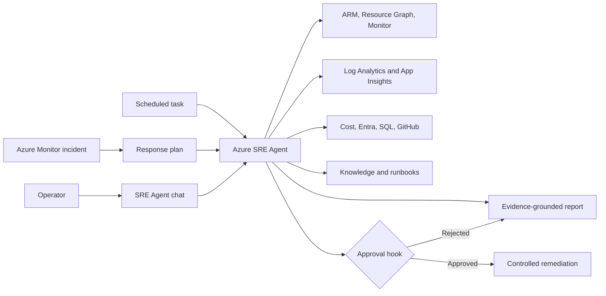

# Azure SRE Agent Enterprise Operations Use-Case Guide

This document explains how to implement, configure, demonstrate, and validate thirteen enterprise
operations use cases with Azure SRE Agent. It also answers the main architecture question for each
case: **must the lab deploy a new Azure service, or can it reuse resources already in this repository?**

The recommended design is one modular lab with one primary SRE Agent. Do not deploy thirteen agents
or thirteen independent environments. Start with the existing Zava, VM, deployment-compliance, and
public-port labs, and enable only the optional modules needed for a workshop.

## 1. Executive resource decision

### Short answer

- **No new workload service is required** for use cases 1, 3, 5, 6, 7, 10, 11, and the base version
  of 12. These use existing resources plus telemetry, permissions, skills, prompts, or scheduled tasks.
- **A small network extension is recommended** for use case 2 if the demo must show a true hub-to-spoke
  path. The existing Zava network can provide a simplified version.
- **No new compute service is required** for use cases 8 and 9, but both need data that the current
  lab does not provide: Entra diagnostic logs for 8 and sufficient historical metrics for 9.
- **Azure SQL Managed Instance is required** for an exact SQL MI demonstration in use case 4. It
  should be an opt-in module because it has material cost and provisioning time. The existing
  PostgreSQL performance lane is a valid low-cost substitute for teaching the investigation method.
- **A second accessible subscription in the same Microsoft Entra tenant is required** for a genuine
   multi-subscription demonstration in use case 13.

### Resource classification

| # | Use case | New Azure service required? | What must be added or configured | Cost/setup impact |
|---:|---|---|---|---|
| 1 | Application outage RCA | No | Reuse Zava workload, App Insights, LAW, Activity Log, alerts | Low |
| 2 | Hub/spoke/internet connectivity | Conditional | Add hub VNet and peering for full fidelity; enable Network Watcher/Connection Monitor | Low to medium |
| 3 | VM/infrastructure incident | No | Reuse VM; ensure AMA/DCR, heartbeat, performance counters, boot diagnostics | Low |
| 4 | SQL MI performance | Yes, for exact scenario | SQL MI, database/workload, SQL diagnostics, Query Store/DMV access | High |
| 5 | VM availability, 30 days | No | Retain availability/heartbeat data for 30+ days; add scheduled report | Low |
| 6 | Resources added/removed, 7 days | No | Export subscription Activity Log to LAW; add lifecycle skill/task | Low |
| 7 | Everything changed, 24 hours | No | Reuse Activity Log, deployment and GitHub metadata; add digest skill/task | Low |
| 8 | Entra authentication | No new compute | Configure Entra diagnostic settings; optional test app/service principal | Low, privileged setup |
| 9 | Capacity prediction | No | Retain 14-30 days of metrics and quota data; optional seeded history | Low |
| 10 | Failed deployment | No | Reuse deployment-compliance/Zava bad-release lane | Low |
| 11 | Cost anomaly | No | Grant Cost Management Reader; optional budget alert and synthetic cost fixture | Low |
| 12 | Security incident | No for base | Reuse public-port guard; Defender/Sentinel are optional enrichments | Low to high |
| 13 | Multi-subscription health | Yes, a second scope | Second subscription with sample resources and cross-scope RBAC | Medium |

### Recommended deployment profiles

| Profile | Included use cases | Resources |
|---|---|---|
| Core workshop | 1, 3, 5, 6, 7, 10, 11, 12 | Existing labs plus monitoring and agent configuration |
| Network extension | 2 | Hub VNet, peering, route/NSG fault, Connection Monitor |
| Data and identity extension | 4, 8 | Optional SQL MI plus Entra diagnostic configuration |
| Predictive and fleet extension | 9, 13 | Metric history/seed data plus a second subscription |

## 2. Common architecture

### Existing lab foundations

| Existing lab | Reusable capabilities |
|---|---|
| `labs/zava-learning` | Application, App Gateway, VNet, Container Apps, PostgreSQL, VM, alerts, App Insights, LAW, RCA/reporting, cost audit, incident integration |
| `labs/zava-aks-postgres` | AKS/PostgreSQL availability, performance, networking, failed release, autonomous response patterns |
| `labs/vm-cosmosdb` | VM guest performance, compliance drift, break/fix scripts, approval hook |
| `labs/deployment-compliance` | Subscription Activity Log, caller attribution, deployment correlation, response plan |
| `labs/public-port-guard` | NSG security incident, periodic scan, network write approval hook |
| `labs/terraform-drift-detection` | Expected-versus-actual state and change correlation |

## 3. Build the shared SRE Agent foundation

Complete this section once before implementing individual use cases.

### Step 1: Select scope and ownership

1. Choose one sandbox subscription and one primary lab resource group.
2. Choose the existing Zava workload as the main application boundary.
3. Record the subscription IDs, resource groups, workload names, owners, escalation contacts, and
   approved maintenance window.
4. Decide whether the agent is read-only or may propose controlled writes. Start read-only.
5. Create separate agents if unrelated teams, data residency, or permission boundaries require it.

### Step 2: Deploy or reuse the common Azure resources

The core profile needs:

1. One Azure SRE Agent resource and its managed identity.
2. One Log Analytics workspace with at least 30 days of retention for availability reporting.
3. One workspace-based Application Insights resource connected to the application.
4. Azure Monitor alerts and an action group for symptom-only incidents.
5. Subscription Activity Log diagnostic settings sending Administrative, Security, Policy, and Alert
   categories to the workspace.
6. Azure Monitor Agent and Data Collection Rules for VM heartbeat, required performance counters,
   and selected guest logs.
7. Optional storage for generated reports or synthetic lab history.

Existing labs already provide most of these. Reuse them instead of creating duplicates.

### Step 3: Grant least-privilege access

Grant the SRE Agent managed identity only the roles required for enabled scenarios:

| Role/access | Scope | Needed by |
|---|---|---|
| Reader | Selected resource groups or subscriptions | Most use cases |
| Monitoring Reader | Selected scopes | Metrics, alerts, Resource Health |
| Log Analytics Reader | Workspace | Log and Activity Log queries |
| Cost Management Reader | Subscription or management group | Use case 11 and cost section of 13 |
| Security Reader | Selected subscriptions | Defender evidence in 12 and 13 |
| SQL database read access | Lab database only | Use case 4 |
| SRE Agent Administrator | Agent resource, for lab operator | Agent configuration |

Do not grant Owner, Global Administrator, or broad write roles to the agent. If a remediation exercise
requires a write role, scope it to the lab resource and remove it after the exercise.

### Step 4: Connect evidence sources

In the SRE Agent portal or configuration process:

1. Add the Azure Monitor incident platform.
2. Add the Log Analytics workspace connector.
3. Add the Application Insights connector.
4. Connect the GitHub repository when source/deployment correlation is required.
5. Add Cost Management access through Azure permissions for use case 11.
6. Add SQL query access for use case 4 without storing a password in the repository.
7. Route Entra logs to the existing workspace for use case 8. The agent queries the workspace; it
   does not need tenant-wide administrative write access.
8. Add Defender/Sentinel only if the enhanced security scenario is selected.

### Step 5: Upload knowledge

Create and upload these knowledge files:

1. Estate architecture and request paths.
2. Resource ownership and escalation contacts.
3. SLO, availability formula, maintenance exclusions, and reporting rules.
4. Deployment process and last-known-good strategy.
5. Safety policy listing actions that always require approval.
6. SQL MI diagnostic runbook if use case 4 is enabled.
7. Entra error-code and privacy handling guidance if use case 8 is enabled.

Knowledge must describe the environment and policy. It must not reveal planted fault causes.

### Step 6: Install skills

Create one skill per operational concern, using the proposed files in the parent blueprint. Each
skill must define:

1. The symptoms or questions that activate it.
2. The read tools and data sources it may use.
3. Investigation order and fallback when a source is unavailable.
4. The standard evidence and report schema.
5. Explicit prohibited actions.
6. Verification and completion conditions.

Avoid one large skill containing all thirteen workflows. Smaller descriptions allow the agent to
select the correct procedure and keep tool permissions narrow.

### Step 7: Configure incident response plans

Use symptom-based routing:

| Response plan | Example symptoms | Candidate skills |
|---|---|---|
| Application and deployment | Elevated failures, endpoint unavailable, unhealthy revision | Outage RCA, deployment investigation |
| Infrastructure and network | VM unavailable, connection failed, backend unhealthy | VM investigation, connectivity diagnostics |
| Identity and security | Authentication failures, public exposure, security alert | Entra authentication, security investigation |

Do not put the planted cause in an alert title, description, response-plan name, or routing condition.

### Step 8: Add a blocking approval hook

The hook must block any proposed:

- VM restart, resize, redeploy, disk detach, or guest command;
- NSG, route, peering, DNS, firewall, or load-balancer change;
- deployment rollback, revision traffic shift, or configuration write;
- SQL session termination, index/configuration change, or instance scale;
- identity disablement, credential rotation, consent, policy, or RBAC change;
- security containment action that could alter evidence;
- resource deletion, deallocation, or cross-subscription write.

Set the hook to fail closed. Its response must name the target, proposed change, expected impact,
rollback approach, and the exact approval required.

### Step 9: Add scheduled tasks

Create scheduled tasks only after the corresponding interactive prompt passes acceptance testing:

| Task | Suggested cadence | Use case |
|---|---|---:|
| VM availability report | Daily | 5 |
| Resource lifecycle digest | Weekly | 6 |
| Change digest | Daily | 7 |
| Capacity forecast | Weekly | 9 |
| Cost anomaly review | Daily or weekly | 11 |
| Multi-subscription health | Daily | 13 |

Each run should create a new thread, remain read-only, and state scope, UTC window, data freshness,
source coverage, and gaps.

### Step 10: Validate the foundation

Before running any fault:

1. Confirm the agent can enumerate only the approved scopes.
2. Confirm KQL queries return application, VM, and Activity Log data.
3. Confirm the operator can see the agent and configure it.
4. Confirm the agent identity cannot perform an unapproved write.
5. Confirm the approval hook blocks a harmless test proposal.
6. Confirm knowledge search returns the correct architecture and SLO.
7. Capture a healthy baseline for every enabled scenario.

## 4. Use case 1: Application outage root cause analysis

### Purpose and outcome

Correlate application, dependency, infrastructure, network, deployment, and change evidence to identify
why a user-facing service is unavailable. The result is a ranked root-cause analysis, safe mitigation
proposal, recovery verification, and prevention plan.

### Resource decision

**No new service is required.** Reuse `labs/zava-learning` or `labs/zava-aks-postgres`, Application
Insights, Log Analytics, Azure Monitor alerts, Activity Log, and the existing RCA/reporting skills.

### Implementation steps

1. Deploy a healthy Zava workload and verify the public endpoint returns success.
2. Confirm App Insights receives request, dependency, and exception telemetry with stable role names.
3. Export subscription Activity Log to the workspace.
4. Create symptom-only alerts for endpoint failure rate, availability, or HTTP 5xx.
5. Install `outage-rca`, `rca-analysis`, `evidence-before-after`, and reporting skills.
6. Route application availability incidents to the application/deployment response plan.
7. Add a break script that changes one cause, such as scaling an API to zero or deploying an unhealthy
   revision. Do not expose that cause in the incident.
8. Add a reset script and record the healthy revision and endpoint baseline.

### How to use SRE Agent

1. Run the selected break script.
2. Wait for the user-visible check and Azure Monitor alert to fail.
3. Open the incident thread, or start chat with prompt 1 from the prompt pack.
4. Verify that the agent first establishes impact and time window.
5. Verify that it queries requests/exceptions, dependencies, resource state, recent deployments, and
   Activity Log before selecting a cause.
6. Ask the agent to show evidence supporting and contradicting its leading hypothesis.
7. Review the proposed mitigation. Approve only the known-safe lab action if remediation is part of
   the exercise.
8. Require the agent to rerun the original endpoint and telemetry checks after mitigation.
9. Generate the incident commander summary and prevention actions.
10. Reset the lab and close the incident.

### Completion criteria

- The agent identifies the affected tier and onset time.
- At least two independent sources support the root cause.
- A network or database hypothesis is rejected with evidence when it is healthy.
- Recovery is verified with the original user-visible signal.

## 5. Use case 2: Connectivity diagnostics between hub, spoke, and internet

### Purpose and outcome

Trace a connection across DNS, effective NSGs, routes, peerings, firewall, load balancer, and
destination health to identify the first failing hop and the smallest safe correction.

### Resource decision

**Conditional new resources.** The existing Zava VNet and Application Gateway support a simplified
edge-to-workload exercise. A full hub/spoke/internet exercise should add a hub VNet, peering, a route
table or Azure Firewall path, and Connection Monitor. Azure Firewall is optional because of cost; an
NSG or UDR fault can teach the same diagnostic method.

### Implementation steps

1. Reuse the Zava spoke VNet and workload subnet.
2. For full fidelity, create a hub VNet with non-overlapping address space and peer it with the spoke.
3. Add a route table representing the intended next hop. Add Azure Firewall only for a firewall-specific
   exercise; otherwise use a test VM/NVA path or system routing.
4. Enable Network Watcher in the region and configure Connection Monitor between a source and target.
5. Send relevant firewall or flow logs to Log Analytics when those services are used.
6. Upload a knowledge file containing the intended path, DNS zones, peering model, and expected ports.
7. Install the connectivity-diagnostics skill and built-in network troubleshooting tools.
8. Create a symptom-only connection alert.
9. Create one idempotent fault, such as a high-priority NSG deny, incorrect UDR next hop, or bad
   Application Gateway probe path.
10. Protect all network writes with the blocking approval hook.

### How to use SRE Agent

1. Capture a successful Connection Monitor or endpoint baseline.
2. Inject one path fault and wait for the symptom.
3. Start the network incident thread or use prompt 2.
4. Require a hop-by-hop table showing DNS, source NIC, effective NSG, route, peering, firewall/NVA,
   load balancer, and listener health.
5. Confirm the agent uses effective state and recent Activity Log changes, not only template intent.
6. Ask it to identify the first failing hop and reject healthy hops.
7. Review the smallest proposed correction and its blast radius.
8. Approve the lab-only fix if desired.
9. Verify Connection Monitor and the application endpoint return to healthy.
10. Reset the route, NSG, or probe to the checked-in baseline.

### Completion criteria

- The first failing hop is correct.
- DNS, routing, policy, transport, and application failure are distinguished.
- No broad NSG or route replacement is proposed when a single-rule correction is sufficient.

## 6. Use case 3: VM and infrastructure incident investigation

### Purpose and outcome

Determine whether a VM incident is caused by Azure platform health, configuration, guest OS,
process, CPU, memory, disk, or network conditions, then produce an evidence-based incident report.

### Resource decision

**No new service is required.** Reuse a VM from `labs/vm-cosmosdb` or the Zava reporting worker. The
required additions are Azure Monitor Agent/Data Collection Rules if guest telemetry is missing.

### Implementation steps

1. Confirm boot diagnostics and Resource Health are available for the VM.
2. Install AMA and configure heartbeat, CPU, memory, disk free space, disk latency/queue, and selected
   system/application logs through a DCR.
3. Capture normal metric ranges and active services in the VM runbook.
4. Install the VM incident investigation skill.
5. Create symptom-only alerts for heartbeat loss, sustained CPU, disk space, or application failure.
6. Create safe break/reset pairs for one cause at a time: CPU stress, disk fill using a bounded file,
   stopped application service, or stopped VM.
7. Gate restart, resize, Run Command, disk, and network operations.

### How to use SRE Agent

1. Run one VM fault and note the UTC start time.
2. Open the incident or use prompt 3.
3. Verify the agent checks Resource Health and power state before guest metrics.
4. Require correlation of heartbeat, performance, boot/guest logs, extensions, effective network, and
   Activity Log.
5. Ask it to classify the fault domain and provide confidence.
6. Reject a restart-only answer; restart is a possible mitigation, not a root cause.
7. Approve the least disruptive lab action if required, such as stopping the stress process.
8. Verify heartbeat, metric, service, and user-visible recovery.
9. Generate the VM incident report and reset the lab.

### Completion criteria

- Control-plane and guest evidence agree with the conclusion.
- The report separates platform, VM state, and in-guest failures.
- Unknown guest telemetry is reported as a gap, not interpreted as a healthy VM.

## 7. Use case 4: Azure SQL Managed Instance performance analysis

### Purpose and outcome

Identify whether SQL MI degradation is driven by blocking, waits, query plans/indexes, CPU, IO,
storage, tempdb, workers/sessions, or platform health and recommend a low-risk optimization.

### Resource decision

**A new SQL Managed Instance is required for an exact demonstration.** Make this module opt-in. SQL
MI has substantial cost and provisioning time. For a lower-cost workshop, use the PostgreSQL
performance scenarios in `labs/zava-aks-postgres` and explain that the evidence sources differ.

### Implementation steps

1. Create an isolated delegated subnet sized for SQL MI and confirm region/quota availability.
2. Deploy a minimally sized lab SQL MI permitted by current Azure limits and a sample database.
3. Configure private connectivity from the workload or a controlled query runner.
4. Enable Query Store and retain enough history for the baseline comparison.
5. Route SQL MI diagnostic categories and Azure Monitor metrics to Log Analytics where supported.
6. Create a least-privilege SQL identity that can read required DMVs and Query Store. Do not grant
   `sysadmin` to the agent.
7. Store connection material in Key Vault or use an identity-based path supported by the selected
   connector. Never place credentials in prompts, skills, or source control.
8. Install the SQL MI performance skill and SQL runbook.
9. Create a bounded workload generator and one controlled fault: a blocking transaction, missing
   index, or expensive query. Ensure the reset restores schema and terminates test sessions.
10. Gate session termination, DDL, configuration changes, and scaling.

### How to use SRE Agent

1. Run the healthy workload long enough to capture a baseline.
2. Start the controlled blocking or query-performance fault.
3. Use prompt 4 with the SQL MI, database, incident window, and baseline days.
4. Verify the agent correlates Azure metrics with read-only Query Store/DMV evidence.
5. Require a ranked list of waits, blocking chains, expensive queries, and resource pressure.
6. Confirm sensitive SQL text and parameter values are redacted.
7. Review index/query/configuration/scale recommendations and expected benefit.
8. Approve only the prepared lab remediation if execution is part of the exercise.
9. Rerun the same workload and compare latency, waits, and resource metrics.
10. Reset the database and delete the optional SQL MI module after the workshop to stop cost.

### Completion criteria

- Database evidence, not application latency alone, supports the conclusion.
- The agent distinguishes blocking from resource saturation.
- The recommendation includes risk, rollback, and measured before/after impact.

## 8. Use case 5: VM availability report for the past 30 days

### Purpose and outcome

Calculate availability with transparent methodology, separate downtime from unknown telemetry, compare
VMs with an SLO, and explain the most significant outages.

### Resource decision

**No new service is required.** Reuse VM and Monitor data. Configure workspace retention for at least
30 days and ensure the availability source was enabled for the entire period. Seeded history may be
used for a workshop, but it must be labeled synthetic.

### Implementation steps

1. Define the SLO, sampling interval, availability signal, planned-maintenance policy, and unknown-data
   treatment in `slo-and-availability-rules.md`.
2. Retain heartbeat/availability and Resource Health data for at least 30 complete days.
3. Validate that all target VMs send the same signal and record onboarding dates.
4. Install the availability-reporting skill with a fixed formula.
5. Add a daily scheduled task that reports a rolling 30-day window.
6. For a short workshop, ingest an explicitly synthetic time series into a custom table or use a
   prepared report fixture. Do not modify timestamps in real operational tables.

### How to use SRE Agent

1. Use prompt 5 with scope, end time, and SLO.
2. Ask the agent to state the formula and available retention before calculating.
3. Verify each VM row includes observed, available, unavailable, unknown, and excluded minutes.
4. Review the outage timeline and Resource Health/Activity Log attribution.
5. Challenge any VM with missing data and confirm it is not reported as 100 percent available.
6. Run the scheduled-task prompt only after the interactive result is accepted.
7. Export the report and record methodology/version with it.

### Completion criteria

- The requested 30-day window is fully covered or clearly marked incomplete.
- Unknown time is separate from downtime and uptime.
- SLO breach calculations are reproducible from the reported formula.

## 9. Use case 6: Services or resources added or removed in the past week

### Purpose and outcome

Produce a deduplicated lifecycle inventory of resources created, removed, moved, or materially changed,
including caller, deployment, current existence, and governance exceptions.

### Resource decision

**No new service is required.** Subscription Activity Log diagnostic settings and the existing Log
Analytics workspace are sufficient. Azure Resource Graph supplies current state but not deleted state.

### Implementation steps

1. Send Activity Log Administrative, Security, Policy, and Alert categories to Log Analytics.
2. Retain at least seven days, preferably 30 or more.
3. Install the change-intelligence skill with lifecycle classification and correlation-ID grouping.
4. Define approved deployment identities, change windows, and required tags in knowledge.
5. Add a weekly resource-lifecycle scheduled task.
6. Create a seed script that creates, updates, and deletes tagged disposable resources. Record their
   deployment and correlation IDs.

### How to use SRE Agent

1. Run the lifecycle seed script and allow Activity Log ingestion to complete.
2. Use prompt 6 for the selected subscription or resource groups.
3. Verify the agent uses Activity Log for deleted resources and Resource Graph for current existence.
4. Require grouping of child operations into logical deployments.
5. Review Added, Removed, Moved, and Modified tables and caller attribution.
6. Check out-of-window and missing-tag flags against the known seed.
7. Run the weekly scheduled task and compare its totals with the interactive result.
8. Remove any surviving disposable seed resources.

### Completion criteria

- Deleted resources appear even though they are absent from Resource Graph.
- One deployment is not inflated into dozens of unrelated changes.
- Caller and data-retention limitations are stated accurately.

## 10. Use case 7: Show everything changed in the last 24 hours

### Purpose and outcome

Create one risk-ranked timeline covering resource, network, security, RBAC, policy, deployment,
monitoring, and relevant code changes for troubleshooting and change review.

### Resource decision

**No new service is required.** Reuse Activity Log, Log Analytics, deployment history, and the
connected GitHub repository. A daily scheduled task is the only new agent artifact.

### Implementation steps

1. Complete Activity Log export as described in use case 6.
2. Connect GitHub or expose deployment commit/artifact metadata to the agent.
3. Document approved identities, windows, and change-risk rules.
4. Extend the change-intelligence skill with RBAC, policy, diagnostics, alerts, Key Vault metadata,
   network, and deployment categories.
5. Add a daily 24-hour change-digest task.
6. Seed the demo by running several existing break/fix scripts and one failed deployment.

### How to use SRE Agent

1. Use prompt 7 after the seeded changes have reached Activity Log.
2. Require one UTC timeline grouped by correlation/deployment ID.
3. Verify each row includes actor, channel, target, result, and before/after when available.
4. Ask the agent to rank operational risk without claiming causality from timing alone.
5. Correlate active incidents only where independent telemetry supports a relationship.
6. Review failed, suspicious, out-of-window, or unapproved changes.
7. Enable the daily scheduled task after accepting the interactive output.

### Completion criteria

- The result is a logical change digest, not a raw Activity Log dump.
- Failed and successful changes are distinguished.
- Missing code, tenant, or security sources appear as coverage gaps.

## 11. Use case 8: Entra authentication troubleshooting

### Purpose and outcome

Distinguish sign-in/authentication failure, Conditional Access, federation, consent/API permission,
token acquisition, and Azure RBAC authorization problems without exposing sensitive identity data.

### Resource decision

**No new compute service is required, but tenant-level configuration is required.** Route Entra
sign-in and audit logs to Log Analytics. An isolated test app registration or service principal is
recommended to generate safe failures. Some log categories and Conditional Access evidence depend on
tenant licensing and permissions.

### Implementation steps

1. Obtain approval from the Entra/identity owner for a sandbox diagnostic configuration.
2. Route `SignInLogs`, `AuditLogs`, `ServicePrincipalSignInLogs`, and
   `ManagedIdentitySignInLogs` to the existing workspace where available.
3. Grant the agent Log Analytics Reader on that workspace. Do not grant identity administration.
4. Create a test app/service principal or managed identity scoped only to the lab.
5. Generate safe failures by using an intentionally invalid test credential, wrong resource audience,
   missing lab RBAC role, or controlled test policy. Never lock a real user or change production CA.
6. Create an identity error-code knowledge file and privacy/redaction policy.
7. Install the Entra authentication skill with aggregate-first queries.
8. Add the identity/security response plan if alert-driven handling is required.
9. Gate all identity, policy, consent, credential, and RBAC writes.

### How to use SRE Agent

1. Generate one documented test failure and record the UTC window and test principal/object ID.
2. Wait for Entra log ingestion.
3. Use prompt 8 with the test application or principal.
4. Verify the agent aggregates failures and redacts PII, IP details, and credential material.
5. Require it to identify the stage: authentication, token, policy, consent, federation, or Azure
   authorization.
6. Ask it to correlate Entra audit changes and Azure RBAC for the test scope.
7. Review the remediation recommendation. Do not execute identity writes from the agent.
8. Correct the test setup manually or through an approved lab process and verify a successful sign-in
   or authorized operation.
9. Delete or disable the test identity according to the lab cleanup policy.

### Completion criteria

- A successful token followed by RBAC denial is not mislabeled as authentication failure.
- Sensitive data is not included in thread output or reports.
- Licensing, ingestion, and permission gaps are explicit.

## 12. Use case 9: Capacity exhaustion prediction

### Purpose and outcome

Estimate when workload demand or Azure quotas will cross warning and critical headroom, with data
quality, uncertainty, and enough lead time for action.

### Resource decision

**No new Azure service is mandatory.** Reuse Azure Monitor metrics, Log Analytics, and quota data.
The use case needs 14 to 30 days of representative history. Synthetic history is optional for a
workshop and must be kept in a separate custom table or fixture.

### Implementation steps

1. Select capacity dimensions with real limits: disk space/IOPS, database storage/connections,
   VM/VMSS or AKS compute, Container Apps replicas, network throughput, ingestion cap, and quota.
2. Document hard limits, practical thresholds, warning levels, and provisioning lead times.
3. Retain hourly metrics for at least 14 days; 30 or more is preferred for weekly seasonality.
4. Grant read access to subscription quota and usage.
5. Install the capacity-forecast skill with missing-data handling and confidence rules.
6. Implement forecast computation with an approved built-in analysis/Python capability. Use trend and
   seasonality only where history supports them.
7. Create a separate labeled synthetic time-series fixture when a workshop cannot wait for history.
8. Add a weekly forecast task. Do not let it scale or request quota automatically.

### How to use SRE Agent

1. Use prompt 9 with scope, history length, and forecast horizon.
2. Verify the agent checks sample count, gaps, outliers, and seasonality before fitting a forecast.
3. Require current usage, limit, headroom, growth rate, forecast date/range, confidence, and lead time.
4. Compare service capacity with regional/subscription quota so the true constraint is clear.
5. Challenge a short CPU spike and verify it is not treated as a sustained exhaustion trend.
6. Review recommendations, such as cleanup, right-sizing, partitioning, scaling, or quota request.
7. Enable the weekly task after the forecast is reproducible.

### Completion criteria

- Insufficient history returns `Inconclusive`, not an invented date.
- Confidence intervals or forecast ranges are shown.
- Quota exhaustion is distinguished from resource/workload exhaustion.

## 13. Use case 10: Failed deployment investigation

### Purpose and outcome

Find the first failing deployment stage and distinguish ARM/pipeline failure from a successful rollout
that introduced a runtime regression, drift, policy denial, permission issue, or quota problem.

### Resource decision

**No new service is required.** Reuse `labs/deployment-compliance`, the Zava bad-deploy scenario,
Activity Log, deployment history, App Insights, and GitHub metadata.

### Implementation steps

1. Connect the workload repository and expose commit, workflow/run, image digest, and revision metadata.
2. Export Activity Log and retain ARM deployment operations.
3. Ensure application telemetry identifies revisions or versions.
4. Install the deployment-investigation skill and deployment safety knowledge.
5. Create a symptom-only alert for unhealthy runtime behavior and route it to the application/deployment
   response plan.
6. Provide two fault types: a deliberately failed ARM deployment and a successful deployment of an
   unhealthy revision.
7. Record the last known good revision and rollback procedure.
8. Gate redeploy, rollback, traffic shift, and configuration changes.

### How to use SRE Agent

1. Run one deployment fault and capture deployment/run IDs.
2. Open the incident or use prompt 10.
3. Require a timeline from commit/artifact through pipeline and ARM operations to runtime health.
4. Verify the agent identifies the first failing stage.
5. Ask it to compare desired state, actual state, and last known good state.
6. Review rollback versus roll-forward recommendation, blast radius, and risk.
7. Approve the prepared lab rollback only if execution is intended.
8. Verify revision health, endpoint behavior, and alert resolution.
9. Reset the deployment and preserve the investigation report.

### Completion criteria

- Control-plane failure and runtime regression are not conflated.
- The first bad revision or failed operation is identified.
- The last known good state is preserved and recovery is verified.

## 14. Use case 11: Azure cost anomaly detection

### Purpose and outcome

Identify material spend changes, explain their operational drivers, distinguish anomalies from billing
timing or allocation changes, and recommend measurable savings.

### Resource decision

**No new service is required.** Reuse the Zava `cost-analysis` skill and scheduled task. Add Cost
Management Reader. A budget/anomaly alert is optional. Because billing data is delayed, a synthetic
cost export may be used for an immediate workshop if clearly labeled.

### Implementation steps

1. Grant Cost Management Reader at the selected subscription or management-group scope.
2. Define actual versus amortized cost, baseline window, materiality thresholds, and accepted data lag.
3. Install or reuse the cost-analysis skill and cost analyst agent.
4. Add Activity Log and utilization correlation to explain SKU/scale/resource changes.
5. Create a daily or weekly cost-anomaly task.
6. Optionally configure Azure budgets and route a budget/anomaly notification into the incident path.
7. Seed either a real but bounded lab scale-up, which may take time to appear in billing, or a clearly
   synthetic cost fixture for a deterministic demonstration.
8. Keep all stop, resize, reservation, and deletion actions read-only recommendations.

### How to use SRE Agent

1. Use prompt 11 with current and baseline windows.
2. Require the agent to state actual/amortized/estimated source and data freshness.
3. Review absolute and percentage deltas by resource, service, subscription, and tag.
4. Ask it to correlate top drivers with scale, SKU, deployment, and utilization changes.
5. Verify delayed charges or allocation changes are not automatically labeled anomalies.
6. Review monthly impact and savings recommendations.
7. Enable the scheduled task after validating the baseline and thresholds.
8. Remove any temporary scaled resource after the exercise.

### Completion criteria

- The top seeded or real cost driver is identified.
- Billed values are not confused with inventory estimates.
- Data latency and confidence are included in the report.

## 15. Use case 12: Security incident investigation

### Purpose and outcome

Build an evidence-preserving timeline, identify affected identities/assets and blast radius, and
recommend containment, eradication, recovery, and prevention without overstating compromise.

### Resource decision

**No new service is required for the base scenario.** Reuse `labs/public-port-guard`, Activity Log,
NSG state, and VM/application telemetry. Defender for Cloud or Microsoft Sentinel can enrich the
scenario but may add licensing and ingestion cost.

### Implementation steps

1. Deploy the public-port-guard lab with a non-sensitive test workload.
2. Export Activity Log and collect the network/security telemetry available in the selected profile.
3. Grant Security Reader only when Defender evidence is used.
4. Optionally connect Defender for Cloud or Sentinel incidents for a richer SOC workflow.
5. Upload evidence-handling, redaction, and escalation policy.
6. Install the security-investigation skill and identity/security response plan.
7. Use an idempotent break script to expose a safe lab port or weaken one NSG rule. Do not expose a
   real administrative service with reusable credentials.
8. Gate NSG, identity, credential, isolation, deletion, and evidence-altering actions.

### How to use SRE Agent

1. Capture the secure baseline and run the controlled exposure script.
2. Wait for the NSG-change or security incident.
3. Use prompt 12 with the incident and UTC window.
4. Require a timeline across alert, Activity Log caller, NSG state, flow/connection evidence, identity,
   VM/application logs, and deployment history.
5. Verify every conclusion is labeled observed, inferred, or unknown.
6. Confirm the agent says “exposed” rather than “compromised” unless evidence proves compromise.
7. Review containment actions and obtain incident-commander approval before any write.
8. Restore the secure rule, verify exposure is closed, and preserve the report/evidence references.
9. Reset the lab and close the incident.

### Completion criteria

- Actor/change attribution and affected asset are correct.
- Exposure and confirmed compromise are clearly distinguished.
- Evidence references, gaps, and escalation conditions are preserved.

## 16. Use case 13: Multi-subscription operational health overview

### Purpose and outcome

Provide a normalized estate scorecard for health, incidents, SLO, capacity, security, deployment,
change, and cost across authorized subscriptions while making blind spots explicit.

### Resource decision

**A second accessible subscription in the same Microsoft Entra tenant is required for a genuine
demonstration.** It may already exist; the lab does not need to create a subscription. Deploy at
least one representative resource or reuse an existing sandbox workload in each subscription.

### Implementation steps

1. Select two same-tenant sandbox subscriptions and document owner and escalation boundary for each.
2. Verify both subscriptions report the same tenant ID before configuring access.
3. Grant the agent identity Reader, Monitoring Reader, and required workspace access in both.
4. Grant Cost Management Reader and Security Reader only if those sections are included.
5. Export Activity Log and connect required workspaces from each subscription.
6. Standardize severity, SLO, tags, owner metadata, and stale-data thresholds in knowledge.
7. Install the fleet-health skill and daily scheduled task.
8. Create a test condition where one subscription is healthy and the other has a known alert, failed
   deployment, capacity risk, or intentionally missing permission.
9. Keep the entire workflow read-only.

### How to use SRE Agent

1. Verify the agent can list each approved subscription before running the report.
2. Use prompt 13 with explicit subscription IDs and UTC window.
3. Require a per-subscription coverage check before health aggregation.
4. Review the normalized scorecard and ensure shared incidents are not double-counted.
5. Confirm inaccessible scopes, stale workspaces, and missing roles are reported as blind spots, not
   healthy status.
6. Review top cross-estate risks, owners, and recommended actions.
7. Enable the daily scheduled task only after the interactive scorecard is accepted.
8. Remove temporary cross-subscription roles and sample resources after the workshop.

### Completion criteria

- Both subscriptions contribute evidence or are explicitly marked inaccessible.
- Severity and SLO comparisons use documented normalization.
- The agent performs no cross-subscription remediation.

## 17. Suggested implementation sequence

### Phase 1: Core profile

Implement and validate use cases 1, 3, 6, 7, 10, 11, and 12 using existing labs. Then add use case 5
once the availability methodology and data coverage are ready.

### Phase 2: Configuration and small extensions

Implement use case 2 with a hub/spoke extension, use case 8 with Entra diagnostics, and use case 9
with retained or synthetic metric history.

### Phase 3: Expensive and cross-boundary modules

Implement SQL MI for use case 4 and a second subscription for use case 13 only when the workshop
requires those exact services. Make deployment and cleanup explicit to control cost and permissions.

## 18. End-to-end acceptance checklist

The scenario pack is complete when:

- every selected use case has a healthy baseline, one-cause fault/seed, reset, and acceptance test;
- all alerts describe symptoms and do not reveal the planted cause;
- the agent identifies scope, UTC window, sources, gaps, facts, inference, and confidence;
- causal conclusions use at least two independent evidence types where available;
- empty queries and permission failures produce `Inconclusive`, not `Healthy`;
- no disruptive or write action bypasses the blocking approval hook;
- scheduled tasks create fresh threads and remain read-only;
- reports are reproducible from documented formulas and source windows;
- sensitive identity, security, SQL, and credential data is redacted;
- optional SQL MI, firewall/Sentinel, synthetic data, test identities, cross-subscription roles, and
  other cost-bearing resources have documented cleanup;
- a facilitator can deploy, inject, investigate, verify, and reset each lane using checked-in files.

## 19. Related files

- [Scenario-pack architecture and build matrix](../README.md)
- [Copy-ready prompts for all thirteen use cases](../prompts/scenario-prompts.md)
- [Zava Learning lab](../../zava-learning/README.md)
- [VM performance diagnostics skill](../../vm-cosmosdb/skills/vm-performance-diagnostics/SKILL.md)
- [Deployment compliance lab](../../deployment-compliance/README.md)
- [Public port guard lab](../../public-port-guard/README.md)
- [AKS and PostgreSQL lab](../../zava-aks-postgres/README.md)
